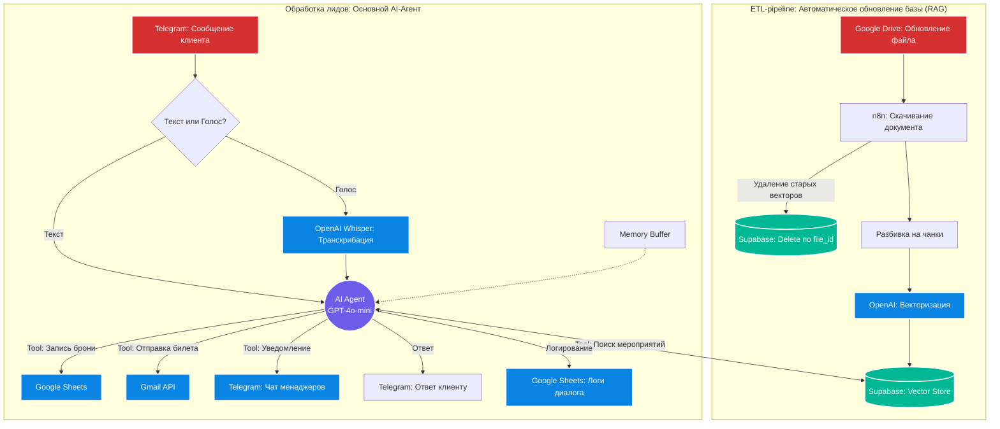

# 🤖 EventFlow AI: Автономный AI-менеджер с RAG и инструментами бронирования

Автономный AI-сотрудник для агентства деловых мероприятий. Заменяет первую линию поддержки: консультирует клиентов по базе мероприятий, обрабатывает текстовые и голосовые сообщения, самостоятельно оформляет бронирование и отправляет подтверждения на email.

## 💼 Бизнес-задача
* **Проблема:** Менеджеры тратили часы на однотипные консультации, клиенты долго ждали ответа в нерабочее время, часть лидов терялась на этапе сбора контактных данных.
* **Решение:** Внедрен AI-агент, который отвечает за секунды 24/7, распознает голосовые запросы, находит нужные мероприятия в базе компании без галлюцинаций (RAG) и автоматически закрывает сделку, фиксируя бронь.

## 🏗 Архитектура решения

Решение состоит из двух независимых воркфлоу:

1. Автоматическая база знаний (ETL-pipeline)
Система поддерживает актуальность "мозга" нейросети без ручного вмешательства:

Триггер отслеживает изменения прайсов и расписаний в заданной папке Google Drive.

Воркфлоу определяет тип файла (Docs/Sheets), скачивает его и удаляет старые векторы этого файла из БД.

Документ дробится на чанки (Recursive Character Text Splitter), векторизуется через OpenAI Embeddings и загружается в Supabase.
Результат: AI всегда консультирует только по актуальным ценам и датам.

2. Главный AI-Агент (Обработка лидов)
Полный цикл ведения клиента в Telegram:

Мультимодальный вход: Пользователь может написать текст или отправить голосовое сообщение (автоматически транскрибируется через Whisper).

Семантический поиск (RAG): Агент использует инструмент vectorStore для поиска релевантных мероприятий в Supabase.

Сбор данных: Бот последовательно запрашивает ФИО и Email.

Function Calling (Инструменты действия): После сбора контактов агент автоматически запускает цепочку действий:

📝 Записывает данные клиента и статус "Новая" в Google Sheets.

✉️ Формирует и отправляет красивое подтверждение бронирования через Gmail.

🔔 Отправляет push-уведомление менеджерам компании в секретный Telegram-чат.

Логирование: Каждый диалог, включая использованные RAG-чанки, записывается в таблицу для контроля качества и аналитики.

🛠 Технологический стек
Оркестрация: n8n (Low-code)

LLM & AI: OpenAI (GPT-4o-mini), OpenAI Embeddings, Whisper (распознавание голоса)

База данных & RAG: Supabase (pgvector)

Интеграции: Telegram API, Google Drive API, Google Sheets API, Gmail API

Логика агента: LangChain, Function Calling, Memory Buffer

🚀 Особенности реализации
Защита от галлюцинаций: Агенту строго запрещено придумывать цены и мероприятия. Если ответа нет в векторной базе — он переводит диалог на менеджера.

Smart Update: При обновлении документа в Google Drive не создаются дубли данных в базе — старые векторы file_id удаляются перед загрузкой новых.

Строгая последовательность Tools: Промпт-инженерия настроена так, что агент не может забронировать место без получения полного набора данных (ФИО + Email).

Разработано архитектором AI-систем в рамках создания автономных бизнес-процессов.
